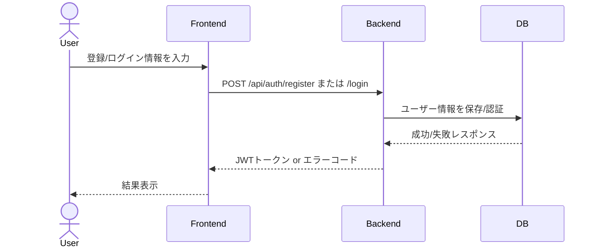
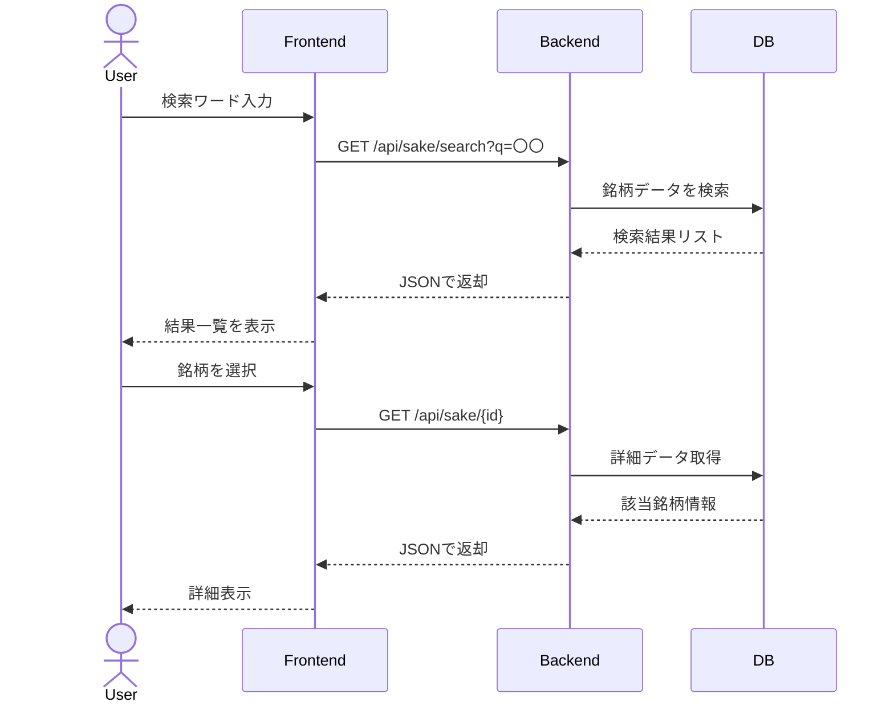
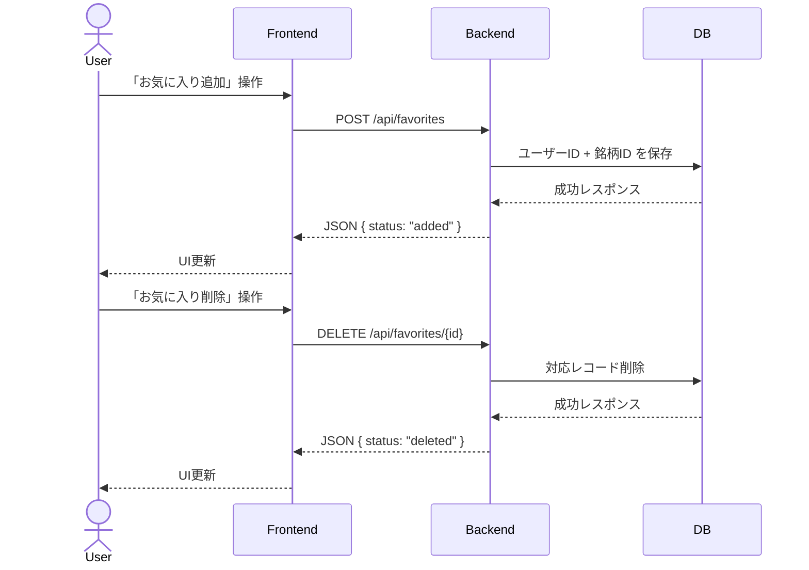
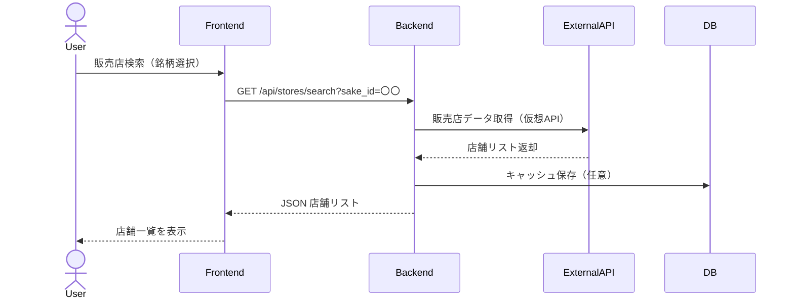

# 日本酒検索アプリ 開発計画書

## 概要
本ドキュメントは、日本酒推薦アプリの開発計画を示す。MVP（Minimum Viable Product）から段階的に機能を拡張し、品質と保守性を重視した開発プロセスを定義する。

## 開発フェーズ

### フェーズ1: MVP（基本機能）
**期間**: 4-6週間
**目標**: 基本的な検索・表示機能の実装

#### 1.1 環境構築・基盤整備
- [x] プロジェクト構造設計
- [x] Django + DRF プロジェクト作成
- [x] データベース設計・ER図作成
- [x] API仕様設計
- [x] UI/UX設計・ワイヤーフレーム

#### 1.2 データベース実装
- [x] Djangoモデル定義
- [x] マイグレーションファイル作成
- [x] 初期データ投入
- [x] インデックス設計・最適化

#### 1.3 バックエンドAPI実装
- [x] 認証システム（JWT）
- [x] ユーザー管理API
- [x] 日本酒検索・詳細API
- [x] 酒蔵情報API
- [x] お気に入り管理API
- [x] サブスクリプション管理API

#### 1.4 フロントエンド実装
- [ ] React プロジェクト作成
- [ ] 基本レイアウト・ナビゲーション
- [ ] 認証画面（ログイン・登録）
- [ ] 検索画面・結果表示
- [ ] 詳細画面
- [ ] お気に入り管理画面
- [ ] プロフィール画面

#### 1.5 統合・テスト
- [ ] API統合テスト
- [ ] フロントエンド単体テスト
- [ ] E2Eテスト
- [ ] パフォーマンステスト

### フェーズ2: 機能拡張
**期間**: 3-4週間
**目標**: 高度な機能とユーザビリティの向上

#### 2.1 検索機能強化
- [ ] 全文検索（PostgreSQL Full-Text Search）
- [ ] フィルタリング機能強化
- [ ] ソート機能強化
- [ ] 検索履歴・おすすめ検索

#### 2.2 ユーザー体験向上
- [ ] レスポンシブデザイン対応
- [ ] ダークモード対応
- [ ] 多言語対応（日本語・英語）
- [ ] アクセシビリティ対応

#### 2.3 パフォーマンス最適化
- [ ] キャッシュ戦略実装
- [ ] 画像最適化
- [ ] 遅延読み込み
- [ ] CDN設定

### フェーズ3: 高度機能
**期間**: 4-6週間
**目標**: AI機能と外部連携の実装

#### 3.1 AI推薦機能
- [ ] LLM API統合
- [ ] 自然言語処理
- [ ] パーソナライゼーション
- [ ] 推薦アルゴリズム最適化

#### 3.2 販売店検索機能
- [ ] 地理情報API統合
- [ ] 店舗データベース構築
- [ ] 在庫状況管理
- [ ] 価格比較機能

#### 3.3 外部連携
- [ ] 決済システム統合
- [ ] 通知システム
- [ ] ソーシャル連携
- [ ] 分析・レポート機能

### フェーズ4: 運用・保守
**期間**: 継続的
**目標**: 安定運用と継続的改善

#### 4.1 運用基盤
- [ ] 監視・ログシステム
- [ ] アラート・通知
- [ ] バックアップ・復旧
- [ ] セキュリティ監査

#### 4.2 継続的改善
- [ ] ユーザーフィードバック収集
- [ ] パフォーマンス監視
- [ ] セキュリティ更新
- [ ] 新機能開発

## 技術実装詳細

### 1. 環境構築

#### 1.1 開発環境
```bash
# 必要なツール
- Python 3.11+
- Node.js 18+
- PostgreSQL 15+
- Redis 7+
- Docker & Docker Compose

# プロジェクト作成
mkdir sake_app
cd sake_app
python -m venv venv
source venv/bin/activate  # Windows: venv\Scripts\activate
pip install -r requirements.txt
```

#### 1.2 依存関係管理
```python
# requirements.txt
Django==4.2.7
djangorestframework==3.14.0
djangorestframework-simplejwt==5.3.0
django-cors-headers==4.3.1
djoser==2.2.0
psycopg2-binary==2.9.7
redis==5.0.1
celery==5.3.4
gunicorn==21.2.0
```

### 2. データベース実装

#### 2.1 マイグレーション実行
```bash
# マイグレーションファイル作成
python manage.py makemigrations

# マイグレーション実行
python manage.py migrate

# 初期データ投入
python manage.py loaddata initial_data.json
```

#### 2.2 データベース最適化
```sql
-- インデックス作成
CREATE INDEX idx_sake_name ON sake(name);
CREATE INDEX idx_sake_brewery_id ON sake(brewery_id);
CREATE INDEX idx_sake_type ON sake(type);

-- 全文検索インデックス
CREATE INDEX idx_sake_search ON sake 
    USING gin(to_tsvector('japanese', name || ' ' || COALESCE(description, '')));
```

### 3. API実装

#### 3.1 認証システム
```python
# settings.py
REST_FRAMEWORK = {
    'DEFAULT_AUTHENTICATION_CLASSES': (
        'rest_framework_simplejwt.authentication.JWTAuthentication',
    ),
    'DEFAULT_PERMISSION_CLASSES': (
        'rest_framework.permissions.IsAuthenticated',
    ),
}

SIMPLE_JWT = {
    'ACCESS_TOKEN_LIFETIME': timedelta(minutes=15),
    'REFRESH_TOKEN_LIFETIME': timedelta(days=7),
    'ROTATE_REFRESH_TOKENS': True,
    'BLACKLIST_AFTER_ROTATION': True,
}
```

#### 3.2 ビュー実装
```python
# views.py
class SakeViewSet(viewsets.ModelViewSet):
    queryset = Sake.objects.select_related('brewery').all()
    serializer_class = SakeSerializer
    permission_classes = [permissions.IsAuthenticatedOrReadOnly]
    
    def get_queryset(self):
        queryset = super().get_queryset()
        q = self.request.query_params.get('q', None)
        if q:
            queryset = queryset.filter(
                Q(name__icontains=q) |
                Q(brewery__name__icontains=q) |
                Q(type__icontains=q)
            )
        return queryset
```

### 4. フロントエンド実装

#### 4.1 React プロジェクト作成
```bash
npx create-react-app sake-frontend --template typescript
cd sake-frontend
npm install @types/react @types/react-dom
npm install axios react-router-dom @tanstack/react-query
npm install tailwindcss @headlessui/react @heroicons/react
```

#### 4.2 状態管理
```typescript
// store/authStore.ts
import { create } from 'zustand';

interface AuthState {
  user: User | null;
  token: string | null;
  login: (credentials: LoginCredentials) => Promise<void>;
  logout: () => void;
}

export const useAuthStore = create<AuthState>((set) => ({
  user: null,
  token: localStorage.getItem('token'),
  login: async (credentials) => {
    const response = await authAPI.login(credentials);
    set({ user: response.user, token: response.access });
    localStorage.setItem('token', response.access);
  },
  logout: () => {
    set({ user: null, token: null });
    localStorage.removeItem('token');
  },
}));
```

#### 4.3 API クライアント
```typescript
// api/client.ts
import axios from 'axios';

const apiClient = axios.create({
  baseURL: process.env.REACT_APP_API_URL || 'http://localhost:8000/api',
  headers: {
    'Content-Type': 'application/json',
  },
});

apiClient.interceptors.request.use((config) => {
  const token = localStorage.getItem('token');
  if (token) {
    config.headers.Authorization = `Bearer ${token}`;
  }
  return config;
});

apiClient.interceptors.response.use(
  (response) => response,
  (error) => {
    if (error.response?.status === 401) {
      localStorage.removeItem('token');
      window.location.href = '/login';
    }
    return Promise.reject(error);
  }
);
```

## ユースケース別シーケンス図

### 1. ユーザー登録・ログイン



### 2. 日本酒検索 → 銘柄詳細表示



### 3. お気に入り登録・削除



### 4. （将来機能）販売店検索



## テスト戦略

### 1. テスト種類

#### 1.1 バックエンドテスト
- **ユニットテスト**: モデル・シリアライザ・ビュー
- **統合テスト**: API エンドポイント
- **データベーステスト**: マイグレーション・クエリ

#### 1.2 フロントエンドテスト
- **コンポーネントテスト**: React Testing Library
- **フックテスト**: カスタムフックの動作確認
- **E2Eテスト**: Cypress による統合テスト

#### 1.3 API テスト
- **機能テスト**: エンドポイントの動作確認
- **パフォーマンステスト**: レスポンス時間・スループット
- **セキュリティテスト**: 認証・認可・入力検証

### 2. テスト環境

```python
# settings_test.py
DATABASES = {
    'default': {
        'ENGINE': 'django.db.backends.postgresql',
        'NAME': 'test_sake_db',
        'USER': 'test_user',
        'PASSWORD': 'test_password',
        'HOST': 'localhost',
        'PORT': '5432',
    }
}

# テスト用設定
DEBUG = False
SECRET_KEY = 'test_secret_key'
```

### 3. テスト実行

```bash
# バックエンドテスト
python manage.py test

# カバレッジ測定
coverage run --source='.' manage.py test
coverage report
coverage html

# フロントエンドテスト
npm test
npm run test:coverage

# E2Eテスト
npm run cypress:open
```

## デプロイ・運用

### 1. 環境別設定

#### 1.1 開発環境
```python
# settings_dev.py
DEBUG = True
ALLOWED_HOSTS = ['localhost', '127.0.0.1']
CORS_ALLOW_ALL_ORIGINS = True

DATABASES = {
    'default': {
        'ENGINE': 'django.db.backends.postgresql',
        'NAME': 'sake_dev_db',
        'USER': 'dev_user',
        'PASSWORD': 'dev_password',
        'HOST': 'localhost',
        'PORT': '5432',
    }
}
```

#### 1.2 本番環境
```python
# settings_prod.py
DEBUG = False
ALLOWED_HOSTS = ['api.sake-app.com']
CORS_ALLOWED_ORIGINS = ['https://sake-app.com']

DATABASES = {
    'default': {
        'ENGINE': 'django.db.backends.postgresql',
        'NAME': os.environ.get('POSTGRES_DB'),
        'USER': os.environ.get('POSTGRES_USER'),
        'PASSWORD': os.environ.get('POSTGRES_PASSWORD'),
        'HOST': os.environ.get('POSTGRES_HOST'),
        'PORT': os.environ.get('POSTGRES_PORT', '5432'),
    }
}
```

### 2. コンテナ化

#### 2.1 Dockerfile
```dockerfile
# Dockerfile
FROM python:3.11-slim

WORKDIR /app

COPY requirements.txt .
RUN pip install -r requirements.txt

COPY . .

EXPOSE 8000

CMD ["gunicorn", "--bind", "0.0.0.0:8000", "sake_project.wsgi:application"]
```

#### 2.2 Docker Compose
```yaml
# docker-compose.yml
version: '3.8'

services:
  web:
    build: .
    ports:
      - "8000:8000"
    environment:
      - DEBUG=False
      - DATABASE_URL=postgresql://user:password@db:5432/sake_db
    depends_on:
      - db
      - redis

  db:
    image: postgres:15
    environment:
      - POSTGRES_DB=sake_db
      - POSTGRES_USER=user
      - POSTGRES_PASSWORD=password
    volumes:
      - postgres_data:/var/lib/postgresql/data

  redis:
    image: redis:7-alpine
    ports:
      - "6379:6379"

volumes:
  postgres_data:
```

### 3. CI/CD

#### 3.1 GitHub Actions
```yaml
# .github/workflows/ci.yml
name: CI/CD Pipeline

on:
  push:
    branches: [ main, develop ]
  pull_request:
    branches: [ main ]

jobs:
  test:
    runs-on: ubuntu-latest
    steps:
      - uses: actions/checkout@v3
      - name: Set up Python
        uses: actions/setup-python@v4
        with:
          python-version: '3.11'
      - name: Install dependencies
        run: |
          pip install -r requirements.txt
      - name: Run tests
        run: |
          python manage.py test

  deploy:
    needs: test
    runs-on: ubuntu-latest
    if: github.ref == 'refs/heads/main'
    steps:
      - name: Deploy to production
        run: |
          echo "Deploying to production..."
```

## 品質保証

### 1. コード品質

#### 1.1 静的解析
```bash
# Python
flake8 .
black --check .
isort --check-only .

# TypeScript
npm run lint
npm run type-check
```

#### 1.2 セキュリティチェック
```bash
# 依存関係の脆弱性チェック
safety check

# Django セキュリティチェック
python manage.py check --deploy
```

### 2. パフォーマンス監視

#### 2.1 メトリクス収集
- API レスポンス時間
- データベースクエリ実行時間
- メモリ使用量
- CPU 使用率

#### 2.2 アラート設定
- レスポンス時間が1秒を超過
- エラー率が5%を超過
- データベース接続エラー
- ディスク容量不足

### 3. ログ管理

#### 3.1 ログレベル
```python
LOGGING = {
    'version': 1,
    'disable_existing_loggers': False,
    'formatters': {
        'verbose': {
            'format': '{levelname} {asctime} {module} {process:d} {thread:d} {message}',
            'style': '{',
        },
    },
    'handlers': {
        'file': {
            'level': 'INFO',
            'class': 'logging.handlers.RotatingFileHandler',
            'filename': 'logs/django.log',
            'maxBytes': 1024*1024*5,
            'backupCount': 5,
            'formatter': 'verbose',
        },
    },
    'root': {
        'handlers': ['file'],
        'level': 'INFO',
    },
}
```

#### 3.2 ログ監視
- エラーログの自動通知
- パフォーマンスログの分析
- セキュリティイベントの監視

## リスク管理

### 1. 技術リスク

#### 1.1 データベース
- **リスク**: パフォーマンス低下、データ損失
- **対策**: インデックス最適化、バックアップ戦略、監視強化

#### 1.2 外部API
- **リスク**: API障害、レート制限
- **対策**: フォールバック処理、キャッシュ戦略、監視・アラート

### 2. セキュリティリスク

#### 2.1 認証・認可
- **リスク**: 不正アクセス、トークン漏洩
- **対策**: JWT セキュリティ強化、セッション管理、監査ログ

#### 2.2 データ保護
- **リスク**: 個人情報漏洩、SQLインジェクション
- **対策**: 暗号化、入力検証、セキュリティテスト

### 3. 運用リスク

#### 3.1 可用性
- **リスク**: サービス停止、パフォーマンス低下
- **対策**: 冗長化、監視・アラート、障害対応手順

#### 3.2 スケーラビリティ
- **リスク**: 負荷増加への対応不足
- **対策**: 負荷テスト、スケーリング戦略、キャッシュ最適化

## 今後の拡張予定

### 1. 機能拡張

#### 1.1 AI機能強化
- 画像認識による銘柄特定
- 音声検索対応
- パーソナライズされた推薦

#### 1.2 ソーシャル機能
- レビュー・評価システム
- ユーザー間の交流
- コミュニティ機能

#### 1.3 ビジネス機能
- オンライン注文システム
- 在庫管理システム
- 分析・レポート機能

### 2. 技術拡張

#### 2.1 アーキテクチャ
- マイクロサービス化
- GraphQL API
- リアルタイム通信（WebSocket）

#### 2.2 インフラ
- Kubernetes 対応
- マルチリージョン展開
- エッジコンピューティング

### 3. プラットフォーム拡張

#### 3.1 モバイル対応
- iOS アプリ
- Android アプリ
- PWA（Progressive Web App）

#### 3.2 多言語対応
- 英語版
- 中国語版
- その他言語

## まとめ

本開発計画書では、日本酒推薦アプリの段階的な開発プロセスを定義した。MVPから始めて、段階的に機能を拡張し、品質と保守性を重視した開発を進める。

各フェーズでの成果物と品質基準を明確にし、継続的な改善とユーザーフィードバックの収集により、ユーザーにとって価値のあるアプリケーションを構築することを目指す。

開発チームは、この計画書に基づいて効率的かつ質の高い開発を進め、定期的な進捗確認と計画の見直しを行うことで、プロジェクトの成功を確実にする。

