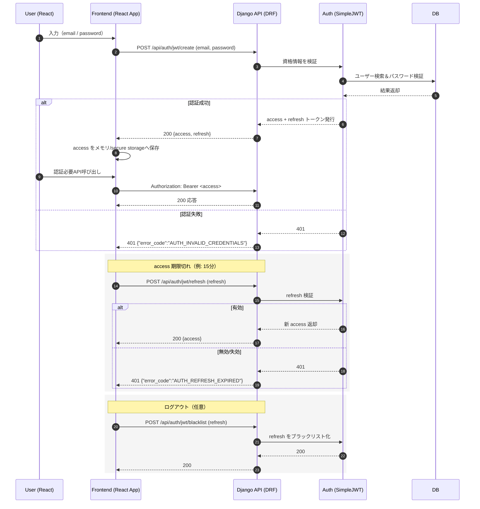

# 日本酒検索アプリ 技術仕様・実装設計

## 技術スタック

### フロントエンド
- **フレームワーク**: React 18.x
- **言語**: TypeScript
- **スタイリング**: Tailwind CSS
- **状態管理**: Zustand / Redux Toolkit
- **ルーティング**: React Router v6
- **HTTP クライアント**: Axios
- **UI コンポーネント**: Headless UI / Radix UI

### バックエンド
- **フレームワーク**: Django 4.2.x + Django REST Framework
- **言語**: Python 3.11+
- **データベース**: PostgreSQL 15+
- **認証**: JWT (djangorestframework-simplejwt)
- **キャッシュ**: Redis
- **検索エンジン**: PostgreSQL Full-Text Search / Elasticsearch

### インフラ・デプロイ
- **ホスティング**: Vercel (フロント) + Railway/Supabase (バックエンド)
- **コンテナ**: Docker
- **CI/CD**: GitHub Actions
- **監視**: Sentry / LogRocket

## Django REST Framework 構成

### プロジェクト構造
```
sake_app/
├── manage.py
├── sake_project/
│   ├── __init__.py
│   ├── settings.py
│   ├── urls.py
│   └── wsgi.py
├── sake_app/
│   ├── __init__.py
│   ├── models.py
│   ├── serializers.py
│   ├── views.py
│   ├── urls.py
│   └── admin.py
├── users/
│   ├── __init__.py
│   ├── models.py
│   ├── serializers.py
│   ├── views.py
│   └── urls.py
├── favorites/
│   ├── __init__.py
│   ├── models.py
│   ├── serializers.py
│   ├── views.py
│   └── urls.py
├── search/
│   ├── __init__.py
│   ├── views.py
│   └── urls.py
└── payments/
    ├── __init__.py
    ├── models.py
    ├── serializers.py
    ├── views.py
    └── urls.py
```

### 設定ファイル（settings.py）

```python
import os
from pathlib import Path
from datetime import timedelta

BASE_DIR = Path(__file__).resolve().parent.parent

SECRET_KEY = os.environ.get("DJANGO_SECRET_KEY", "dummy_secret_key")

DEBUG = os.environ.get("DEBUG", "False").lower() == "true"

ALLOWED_HOSTS = os.environ.get("ALLOWED_HOSTS", "*").split(",")

INSTALLED_APPS = [
    "django.contrib.admin",
    "django.contrib.auth",
    "django.contrib.contenttypes",
    "django.contrib.sessions",
    "django.contrib.messages",
    "django.contrib.staticfiles",
    # 追加
    "rest_framework",
    "rest_framework.authtoken",
    "corsheaders",
    "djoser",
    "sake_app",
    "users",
    "favorites",
    "search",
    "payments",
]

MIDDLEWARE = [
    "django.middleware.security.SecurityMiddleware",
    "django.contrib.sessions.middleware.SessionMiddleware",
    "corsheaders.middleware.CorsMiddleware",
    "django.middleware.common.CommonMiddleware",
    "django.middleware.csrf.CsrfViewMiddleware",
    "django.contrib.auth.middleware.AuthenticationMiddleware",
    "django.contrib.messages.middleware.MessageMiddleware",
    "django.middleware.clickjacking.XFrameOptionsMiddleware",
]

ROOT_URLCONF = "sake_project.urls"

TEMPLATES = [
    {
        "BACKEND": "django.template.backends.django.DjangoTemplates",
        "DIRS": [],
        "APP_DIRS": True,
        "OPTIONS": {
            "context_processors": [
                "django.template.context_processors.debug",
                "django.template.context_processors.request",
                "django.contrib.auth.context_processors.auth",
                "django.contrib.messages.context_processors.messages",
            ],
        },
    },
]

WSGI_APPLICATION = "sake_project.wsgi.application"

# データベース設定
DATABASES = {
    "default": {
        "ENGINE": "django.db.backends.postgresql",
        "NAME": os.environ.get("POSTGRES_DB", "sake_db"),
        "USER": os.environ.get("POSTGRES_USER", "sake_user"),
        "PASSWORD": os.environ.get("POSTGRES_PASSWORD", "password"),
        "HOST": os.environ.get("POSTGRES_HOST", "localhost"),
        "PORT": os.environ.get("POSTGRES_PORT", "5432"),
    }
}

# REST Framework 設定
REST_FRAMEWORK = {
    "DEFAULT_AUTHENTICATION_CLASSES": (
        "rest_framework_simplejwt.authentication.JWTAuthentication",
    ),
    "DEFAULT_PERMISSION_CLASSES": (
        "rest_framework.permissions.IsAuthenticated",
    ),
    "DEFAULT_PAGINATION_CLASS": "rest_framework.pagination.PageNumberPagination",
    "PAGE_SIZE": 20,
    "DEFAULT_FILTER_BACKENDS": (
        "django_filters.rest_framework.DjangoFilterBackend",
        "rest_framework.filters.SearchFilter",
        "rest_framework.filters.OrderingFilter",
    ),
    "DEFAULT_RENDERER_CLASSES": (
        "rest_framework.renderers.JSONRenderer",
    ),
    "DEFAULT_PARSER_CLASSES": (
        "rest_framework.parsers.JSONParser",
    ),
    "DEFAULT_THROTTLE_CLASSES": [
        "rest_framework.throttling.UserRateThrottle",
        "rest_framework.throttling.AnonRateThrottle",
    ],
    "DEFAULT_THROTTLE_RATES": {
        "user": "60/min",   # ログイン済み
        "anon": "10/min",   # 未ログイン
    },
}

# JWT 設定
SIMPLE_JWT = {
    "ACCESS_TOKEN_LIFETIME": timedelta(minutes=15),
    "REFRESH_TOKEN_LIFETIME": timedelta(days=7),
    "ROTATE_REFRESH_TOKENS": True,
    "BLACKLIST_AFTER_ROTATION": True,
    "AUTH_HEADER_TYPES": ("Bearer",),
    "AUTH_HEADER_NAME": "HTTP_AUTHORIZATION",
    "USER_ID_FIELD": "id",
    "USER_ID_CLAIM": "user_id",
    "AUTH_TOKEN_CLASSES": ("rest_framework_simplejwt.tokens.AccessToken",),
    "TOKEN_TYPE_CLAIM": "token_type",
}

# CORS 設定
CORS_ALLOWED_ORIGINS = [
    "http://localhost:3000",  # React 開発サーバー
    "http://127.0.0.1:3000",
]

CORS_ALLOW_CREDENTIALS = True

# カスタムユーザーモデル
AUTH_USER_MODEL = "users.User"

# 静的ファイル設定
STATIC_URL = "/static/"
STATIC_ROOT = os.path.join(BASE_DIR, "staticfiles")

# メディアファイル設定
MEDIA_URL = "/media/"
MEDIA_ROOT = os.path.join(BASE_DIR, "mediafiles")

# ログ設定
LOGGING = {
    "version": 1,
    "disable_existing_loggers": False,
    "formatters": {
        "verbose": {
            "format": "{levelname} {asctime} {module} {process:d} {thread:d} {message}",
            "style": "{",
        },
        "simple": {
            "format": "{levelname} {message}",
            "style": "{",
        },
    },
    "handlers": {
        "file": {
            "level": "INFO",
            "class": "logging.handlers.RotatingFileHandler",
            "filename": os.path.join(BASE_DIR, "logs", "django.log"),
            "maxBytes": 1024 * 1024 * 5,  # 5 MB
            "backupCount": 5,
            "formatter": "verbose",
        },
        "console": {
            "level": "DEBUG",
            "class": "logging.StreamHandler",
            "formatter": "simple",
        },
    },
    "root": {
        "handlers": ["console", "file"],
        "level": "INFO",
    },
    "loggers": {
        "django": {
            "handlers": ["console", "file"],
            "level": "INFO",
            "propagate": False,
        },
    },
}
```

## Django モデル設計

### モデル定義

```python
from django.db import models
from django.contrib.auth.models import AbstractUser
from django.core.validators import MinValueValidator, MaxValueValidator


# ユーザー（拡張認証モデル）
class User(AbstractUser):
    PLAN_CHOICES = [
        ('free', 'Free'),
        ('premium', 'Premium'),
    ]
    email = models.EmailField(unique=True)
    plan = models.CharField(max_length=10, choices=PLAN_CHOICES, default='free')
    updated_at = models.DateTimeField(auto_now=True)

    def __str__(self):
        return self.username


# 酒蔵
class Brewery(models.Model):
    name = models.CharField(max_length=100, unique=True)
    location = models.CharField(max_length=255, null=True, blank=True)
    established = models.PositiveIntegerField(null=True, blank=True)
    url = models.URLField(null=True, blank=True)
    description = models.TextField(null=True, blank=True)
    created_at = models.DateTimeField(auto_now_add=True)
    updated_at = models.DateTimeField(auto_now=True)

    def __str__(self):
        return self.name


# 日本酒銘柄
class Sake(models.Model):
    name = models.CharField(max_length=100, unique=True)
    brewery = models.ForeignKey(Brewery, on_delete=models.CASCADE, related_name="sakes")
    type = models.CharField(max_length=50, null=True, blank=True)
    rice = models.CharField(max_length=100, null=True, blank=True)
    polish_ratio = models.PositiveIntegerField(
        null=True, blank=True,
        validators=[MinValueValidator(0), MaxValueValidator(100)]
    )
    alcohol = models.DecimalField(
        max_digits=3, decimal_places=1, null=True, blank=True,
        validators=[MinValueValidator(0.0), MaxValueValidator(30.0)]
    )
    taste_profile = models.TextField(null=True, blank=True)
    awards = models.TextField(null=True, blank=True)
    official_url = models.URLField(null=True, blank=True)
    created_at = models.DateTimeField(auto_now_add=True)
    updated_at = models.DateTimeField(auto_now=True)

    def __str__(self):
        return self.name


# お気に入り
class Favorite(models.Model):
    user = models.ForeignKey(User, on_delete=models.CASCADE, related_name="favorites")
    sake = models.ForeignKey(Sake, on_delete=models.CASCADE, related_name="favorited_by")
    created_at = models.DateTimeField(auto_now_add=True)

    class Meta:
        unique_together = ('user', 'sake')
        ordering = ['-created_at']

    def __str__(self):
        return f"{self.user.username} - {self.sake.name}"


# 課金管理
class Payment(models.Model):
    PLAN_CHOICES = [
        ('free', 'Free'),
        ('premium', 'Premium'),
    ]
    STATUS_CHOICES = [
        ('active', 'Active'),
        ('expired', 'Expired'),
        ('canceled', 'Canceled'),
        ('pending', 'Pending'),
    ]

    user = models.ForeignKey(User, on_delete=models.CASCADE, related_name="payments")
    plan = models.CharField(max_length=10, choices=PLAN_CHOICES)
    status = models.CharField(max_length=10, choices=STATUS_CHOICES, default='pending')
    started_at = models.DateTimeField(auto_now_add=True)
    ended_at = models.DateTimeField(null=True, blank=True)
    created_at = models.DateTimeField(auto_now_add=True)
    updated_at = models.DateTimeField(auto_now=True)

    def __str__(self):
        return f"{self.user.username} - {self.plan} ({self.status})"


# 販売店（将来構想）
class Store(models.Model):
    name = models.CharField(max_length=100)
    location = models.CharField(max_length=255, null=True, blank=True)
    url = models.URLField(null=True, blank=True)
    phone = models.CharField(max_length=20, null=True, blank=True)
    created_at = models.DateTimeField(auto_now_add=True)
    updated_at = models.DateTimeField(auto_now=True)

    def __str__(self):
        return self.name
```

### モデル制約・仕様

- **User**
  - Djangoの `AbstractUser` を継承し拡張
  - `plan` フィールドで無料/有料を判定
  - メールアドレスは一意制約

- **Favorite**
  - ユーザーごとにお気に入り最大5件（バリデーションで制御）
  - `unique_together(user, sake)` で重複登録を防止
  - 作成日時順でソート

- **Payment**
  - 課金履歴を保存し、ステータス管理可能
  - 開始日時は自動設定、終了日時は手動設定

- **Store**
  - 将来の拡張を考慮（現時点では未使用）

## シリアライザ設計

### 基本シリアライザ

```python
from rest_framework import serializers
from .models import User, Sake, Brewery, Favorite, Payment, Store


class UserSerializer(serializers.ModelSerializer):
    class Meta:
        model = User
        fields = ['id', 'username', 'email', 'plan', 'created_at', 'updated_at']
        read_only_fields = ['id', 'created_at', 'updated_at']


class SakeSerializer(serializers.ModelSerializer):
    class Meta:
        model = Sake
        fields = [
            'id', 'name', 'brewery', 'type', 'rice', 
            'polish_ratio', 'alcohol', 'taste_profile', 
            'awards', 'official_url', 'created_at', 'updated_at'
        ]


class BrewerySerializer(serializers.ModelSerializer):
    class Meta:
        model = Brewery
        fields = ['id', 'name', 'location', 'established', 'url', 'description']


class FavoriteSerializer(serializers.ModelSerializer):
    class Meta:
        model = Favorite
        fields = ['id', 'user', 'sake', 'created_at']
        read_only_fields = ['id', 'created_at']


class PaymentSerializer(serializers.ModelSerializer):
    class Meta:
        model = Payment
        fields = ['id', 'user', 'plan', 'status', 'started_at', 'ended_at']


class StoreSerializer(serializers.ModelSerializer):
    class Meta:
        model = Store
        fields = ['id', 'name', 'location', 'url', 'phone']
```

### 個別シリアライザ（詳細版）

#### Sake 検索・詳細表示系

```python
class SakeListSerializer(serializers.ModelSerializer):
    brewery_name = serializers.CharField(source="brewery.name", read_only=True)

    class Meta:
        model = Sake
        fields = ["id", "name", "brewery_name", "type", "alcohol"]


class BreweryNestedSerializer(serializers.ModelSerializer):
    class Meta:
        model = Brewery
        fields = ["id", "name", "location", "established", "url"]


class SakeDetailSerializer(serializers.ModelSerializer):
    brewery = BreweryNestedSerializer(read_only=True)

    class Meta:
        model = Sake
        fields = [
            "id", "name", "brewery", "type", "rice",
            "polish_ratio", "alcohol", "taste_profile",
            "awards", "official_url", "created_at", "updated_at"
        ]
```

#### お気に入り系

```python
class FavoriteCreateSerializer(serializers.ModelSerializer):
    sake_id = serializers.PrimaryKeyRelatedField(
        queryset=Sake.objects.all(),
        source="sake",
        write_only=True
    )

    class Meta:
        model = Favorite
        fields = ["sake_id"]

    def validate(self, attrs):
        user = self.context["request"].user
        sake = attrs["sake"]

        # すでに登録済み？
        if Favorite.objects.filter(user=user, sake=sake).exists():
            raise serializers.ValidationError({"detail": "既にお気に入りに登録されています。"})

        # 無料ユーザーは5件まで
        if user.plan == "free":
            count = Favorite.objects.filter(user=user).count()
            if count >= 5:
                raise serializers.ValidationError({"detail": "無料プランではお気に入りは5件までです。"})
        return attrs

    def create(self, validated_data):
        user = self.context["request"].user
        return Favorite.objects.create(user=user, **validated_data)


class FavoriteListSerializer(serializers.ModelSerializer):
    sake = SakeListSerializer(read_only=True)

    class Meta:
        model = Favorite
        fields = ["id", "sake", "created_at"]
```

#### 認証系

```python
class RegisterSerializer(serializers.Serializer):
    username = serializers.RegexField(r"^[a-zA-Z0-9_]{3,20}$")
    email = serializers.EmailField()
    password = serializers.CharField(write_only=True, min_length=8)
    confirm_password = serializers.CharField(write_only=True, min_length=8)

    def validate(self, attrs):
        if attrs["password"] != attrs["confirm_password"]:
            raise serializers.ValidationError({"confirm_password": "パスワードが一致しません。"})
        return attrs


class LoginSerializer(serializers.Serializer):
    username = serializers.CharField()
    password = serializers.CharField(write_only=True)
```

## ビュー設計

### ViewSet & API設計

```python
from rest_framework import viewsets, status, permissions
from rest_framework.decorators import action
from rest_framework.response import Response
from rest_framework.views import APIView
from django.core.exceptions import ValidationError
from .models import User, Sake, Favorite, Payment
from .serializers import (
    UserSerializer, SakeSerializer, FavoriteSerializer,
    SakeListSerializer, SakeDetailSerializer,
    FavoriteCreateSerializer, FavoriteListSerializer
)


class UserViewSet(viewsets.ModelViewSet):
    queryset = User.objects.all()
    serializer_class = UserSerializer
    permission_classes = [permissions.IsAuthenticatedOrReadOnly]

    def perform_create(self, serializer):
        # 登録時にパスワードをハッシュ化
        password = self.request.data.get("password")
        user = serializer.save()
        if password:
            user.set_password(password)
            user.save()


class SakeViewSet(viewsets.ModelViewSet):
    queryset = Sake.objects.select_related('brewery').all()
    serializer_class = SakeSerializer
    permission_classes = [permissions.IsAuthenticatedOrReadOnly]

    def get_serializer_class(self):
        if self.action == 'list':
            return SakeListSerializer
        elif self.action == 'retrieve':
            return SakeDetailSerializer
        return SakeSerializer

    @action(detail=False, methods=['get'])
    def search(self, request):
        query = request.query_params.get('q', '')
        if query:
            sakes = self.queryset.filter(
                models.Q(name__icontains=query) |
                models.Q(brewery__name__icontains=query) |
                models.Q(type__icontains=query)
            )
        else:
            sakes = self.queryset.all()
        
        serializer = SakeListSerializer(sakes, many=True)
        return Response(serializer.data)


class FavoriteViewSet(viewsets.ModelViewSet):
    queryset = Favorite.objects.all()
    serializer_class = FavoriteSerializer
    permission_classes = [permissions.IsAuthenticated]

    def get_queryset(self):
        return self.queryset.filter(user=self.request.user).select_related('sake', 'sake__brewery')

    def get_serializer_class(self):
        if self.action == 'create':
            return FavoriteCreateSerializer
        elif self.action == 'list':
            return FavoriteListSerializer
        return FavoriteSerializer

    def perform_create(self, serializer):
        user = self.request.user
        if user.plan == "free" and Favorite.objects.filter(user=user).count() >= 5:
            raise ValidationError("お気に入りは最大5件までです。")
        serializer.save(user=user)


class SubscriptionView(APIView):
    permission_classes = [permissions.IsAuthenticated]

    def get(self, request):
        user = request.user
        return Response({
            "plan": user.plan,
            "max_favorites": 5 if user.plan == "free" else 100,
            "llm_calls": 0 if user.plan == "free" else 100
        })


class RecommendationAPIView(APIView):
    '''
    planned: 将来的にLLMベースの推薦を行うAPI
    '''
    def post(self, request):
        return Response({
            "message": "レコメンド機能は現在開発予定です。"
        }, status=200)
```

## ルーティング設計

### メインURL設定（urls.py）

```python
from django.contrib import admin
from django.urls import path, include
from rest_framework import routers
from sake_app.views import (
    UserViewSet, SakeViewSet, FavoriteViewSet,
    SubscriptionView, RecommendationAPIView
)

router = routers.DefaultRouter()
router.register(r'users', UserViewSet, basename='users')
router.register(r'sakes', SakeViewSet, basename='sakes')
router.register(r'favorites', FavoriteViewSet, basename='favorites')

urlpatterns = [
    path('admin/', admin.site.urls),
    path("api/", include(router.urls)),
    path("api/auth/", include("djoser.urls")),
    path("api/auth/jwt/", include("djoser.urls.jwt")),
    path("api/subscription/", SubscriptionView.as_view(), name="subscription"),
    path("api/recommendations/", RecommendationAPIView.as_view(), name="recommendations"),
]
```

### エンドポイント一覧

- `/api/auth/register/` : 新規ユーザー登録
- `/api/auth/login/` : ログイン
- `/api/auth/jwt/create/` : JWTトークン発行
- `/api/auth/jwt/refresh/` : アクセストークン更新
- `/api/auth/jwt/verify/` : トークン検証
- `/api/auth/jwt/blacklist/` : ログアウト
- `/api/users/` : ユーザー一覧・詳細
- `/api/sakes/` : 日本酒一覧・検索
- `/api/sakes/{id}/` : 日本酒詳細
- `/api/sakes/search/` : 日本酒検索
- `/api/favorites/` : お気に入り一覧・登録
- `/api/favorites/{id}/` : お気に入り削除
- `/api/subscription/` : サブスクリプション確認
- `/api/recommendations/` : レコメンド機能（将来構想）

## 認証・セキュリティ設計

### JWT認証フロー



### セキュリティ設定

- **JWT設定**
  - アクセストークン: 15分
  - リフレッシュトークン: 7日
  - トークンローテーション: 有効
  - ブラックリスト: 有効

- **レート制限**
  - ログイン済みユーザー: 60回/分
  - 未ログインユーザー: 10回/分

- **CORS設定**
  - 許可オリジン: 開発環境のみ
  - クレデンシャル: 有効

## ログ・監視設計

### Loggerクラス実装

```python
import logging
from logging.handlers import RotatingFileHandler
import os
from datetime import datetime

class AppLogger:
    def __init__(self, name="app_logger", log_dir="logs", max_bytes=5*1024*1024, backup_count=5):
        os.makedirs(log_dir, exist_ok=True)
        log_file = os.path.join(log_dir, f"{datetime.now().strftime('%Y-%m-%d')}.log")

        self.logger = logging.getLogger(name)
        self.logger.setLevel(logging.DEBUG)

        handler = RotatingFileHandler(log_file, maxBytes=max_bytes, backupCount=backup_count)
        formatter = logging.Formatter('%(asctime)s [%(levelname)s] %(name)s: %(message)s')
        handler.setFormatter(formatter)

        if not self.logger.handlers:
            self.logger.addHandler(handler)

    def debug(self, message):
        self.logger.debug(message)

    def info(self, message):
        self.logger.info(message)

    def warning(self, message):
        self.logger.warning(message)

    def error(self, message):
        self.logger.error(message)

    def critical(self, message):
        self.logger.critical(message)
```

### ログレベル・出力先

- **DEBUG**: 開発時の詳細情報
- **INFO**: 一般的な操作ログ
- **WARNING**: 警告・注意事項
- **ERROR**: エラー・例外
- **CRITICAL**: 重大なエラー

### 監視・通知

- **エラー監視**: Sentry統合
- **パフォーマンス監視**: Django Debug Toolbar
- **ログ監視**: ファイルローテーション + 外部監視ツール

## パフォーマンス最適化

### データベース最適化

- **N+1問題対策**
  - `select_related()`: 外部キー関連
  - `prefetch_related()`: 多対多関連

- **インデックス設計**
  - 検索頻度の高いフィールド
  - 外部キー
  - 複合インデックス

### キャッシュ戦略

- **Redisキャッシュ**
  - 検索結果
  - ユーザーセッション
  - 静的データ

- **CDN**
  - 静的ファイル
  - 画像・メディア

## テスト戦略

### テスト種類

- **ユニットテスト**: モデル・シリアライザ・ビュー
- **統合テスト**: API エンドポイント
- **E2Eテスト**: フロントエンド連携
- **負荷テスト**: パフォーマンス検証

### テスト環境

- **テストデータベース**: PostgreSQL
- **モック**: 外部API・LLM呼び出し
- **フィクスチャ**: サンプルデータ

## デプロイ・運用

### 環境別設定

- **開発環境**: ローカル開発
- **ステージング環境**: テスト・検証
- **本番環境**: 本格運用

### コンテナ化

- **Docker**: アプリケーション・データベース
- **Docker Compose**: 開発環境
- **Kubernetes**: 本番環境（将来的）

### CI/CD

- **GitHub Actions**: 自動テスト・ビルド・デプロイ
- **コード品質**: ESLint・Black・Flake8
- **セキュリティ**: 依存関係チェック

## 将来拡張予定

### 機能拡張

- **販売店検索API**: 地理情報対応
- **レコメンドAPI**: LLM統合
- **画像認識**: 酒瓶画像からの銘柄特定
- **ソーシャル機能**: レビュー・評価

### 技術拡張

- **GraphQL**: 柔軟なデータ取得
- **WebSocket**: リアルタイム通知
- **マイクロサービス**: 機能別分割
- **AI/ML**: 機械学習による推薦

