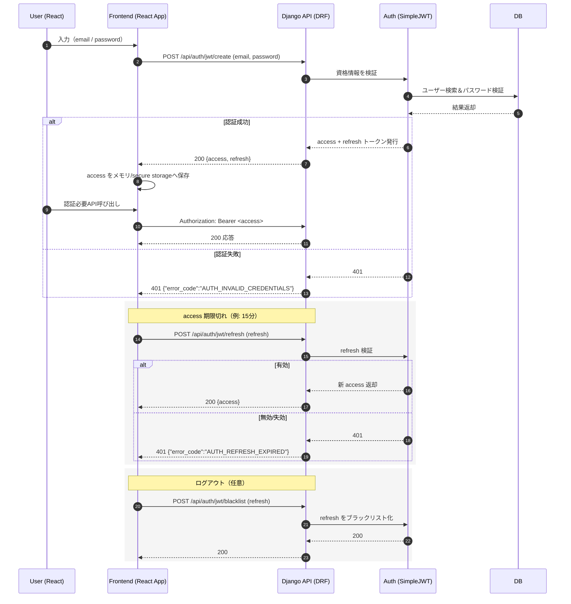

# 認証フロー（シーケンス図）＋ Router & 認証設計（統合ドキュメント）

本書は **JWT認証（SimpleJWT）** を用いたフローと、**DRF Router定義**・関連設定をまとめた実装指針です。

---

## 1) 認証フロー（Mermaid シーケンス図）



---

## 2) エンドポイント定義（認証関連）

- `POST /api/auth/register/` … ユーザー登録（任意実装: djoser または独自View）
- `POST /api/auth/jwt/create/` … ログイン（access/refresh発行）
- `POST /api/auth/jwt/refresh/` … access更新
- `POST /api/auth/jwt/verify/` … トークン検証
- `POST /api/auth/jwt/blacklist/` … ログアウト相当（refresh 無効化）
- `GET /api/auth/profile/` … 自分のプロフィール取得（要JWT）

**トークン寿命（推奨）**  
- access: **15分**
- refresh: **7日**

---

## 3) Router 定義（サンプル）

```python
# urls.py
from rest_framework import routers
from django.urls import path, include
from .views import UserViewSet, SakeViewSet, FavoriteViewSet
from .auth_views import ProfileView

router = routers.DefaultRouter()
router.register(r'users', UserViewSet, basename='users')
router.register(r'sakes', SakeViewSet, basename='sakes')
router.register(r'favorites', FavoriteViewSet, basename='favorites')

urlpatterns = [
    path("api/", include(router.urls)),
    # djoser + simplejwt を採用する場合
    path("api/auth/", include("djoser.urls")),
    path("api/auth/jwt/", include("djoser.urls.jwt")),
    # プロフィール（例: 独自View）
    path("api/auth/profile/", ProfileView.as_view()),
]
```

---

## 4) settings.py（主要設定スニペット）

```python
INSTALLED_APPS = [
    # 省略
    "rest_framework",
    "rest_framework_simplejwt.token_blacklist",
    "djoser",
    "corsheaders",
]

MIDDLEWARE = [
    "corsheaders.middleware.CorsMiddleware",
    # 省略
]

REST_FRAMEWORK = {
    "DEFAULT_AUTHENTICATION_CLASSES": (
        "rest_framework_simplejwt.authentication.JWTAuthentication",
    ),
    "DEFAULT_THROTTLE_CLASSES": [
        "rest_framework.throttling.UserRateThrottle",
        "rest_framework.throttling.AnonRateThrottle",
    ],
    "DEFAULT_THROTTLE_RATES": {
        "user": "60/min",   # ログイン済み
        "anon": "10/min",   # 未ログイン
    },
    "DEFAULT_RENDERER_CLASSES": (
        "rest_framework.renderers.JSONRenderer",
    ),
}

from datetime import timedelta
SIMPLE_JWT = {
    "ACCESS_TOKEN_LIFETIME": timedelta(minutes=15),
    "REFRESH_TOKEN_LIFETIME": timedelta(days=7),
    "ROTATE_REFRESH_TOKENS": False,
    "BLACKLIST_AFTER_ROTATION": True,
    "AUTH_HEADER_TYPES": ("Bearer",),
}

# CORS（Reactフロントと接続）
CORS_ALLOW_ALL_ORIGINS = False
CORS_ALLOWED_ORIGINS = [
    "http://localhost:3000",  # React dev
    # "https://your-frontend.example.com",
]
```

---

## 5) View（例: プロフィール / ログアウト）

```python
# auth_views.py
from rest_framework.views import APIView
from rest_framework.permissions import IsAuthenticated
from rest_framework.response import Response
from rest_framework import status

class ProfileView(APIView):
    permission_classes = [IsAuthenticated]

    def get(self, request):
        user = request.user
        return Response({
            "id": user.id,
            "username": user.username,
            "email": user.email,
            "plan": getattr(user, "plan", "free"),
        })

# ログアウトは djoser の blacklist エンドポイント利用を推奨
```

---

## 6) エラーレスポンス仕様（統一）

```json
{
  "error_code": "AUTH_INVALID_CREDENTIALS",
  "message": "メールアドレスまたはパスワードが違います",
  "detail": null
}
```

> API共通のエラーフォーマットとして、`error_code` を明示。  
> 例: `AUTH_REFRESH_EXPIRED`, `AUTH_TOKEN_INVALID`, `AUTH_PERMISSION_DENIED` など。

---

## 7) 動作確認（curl例）

```bash
# ログイン
curl -X POST http://localhost:8000/api/auth/jwt/create/   -H "Content-Type: application/json"   -d '{"email":"user@example.com","password":"pass"}'

# access を使ってプロフィール取得
curl http://localhost:8000/api/auth/profile/   -H "Authorization: Bearer <ACCESS_TOKEN>"
```

---

## 8) セキュリティ・運用の注意

- JWTは **メモリ/セキュアストレージ** で保持（LocalStorage保管は可否を検討）
- HTTPS 前提／Cookie送信は行わない（Header利用）
- ブラックリスト有効化で logout/unexpected revoke に対応
- N+1を避けるため View では `select_related` を徹底
- 重要イベント（ログイン失敗/成功、リフレッシュ失敗等）はロギング（INFO/ERROR）
