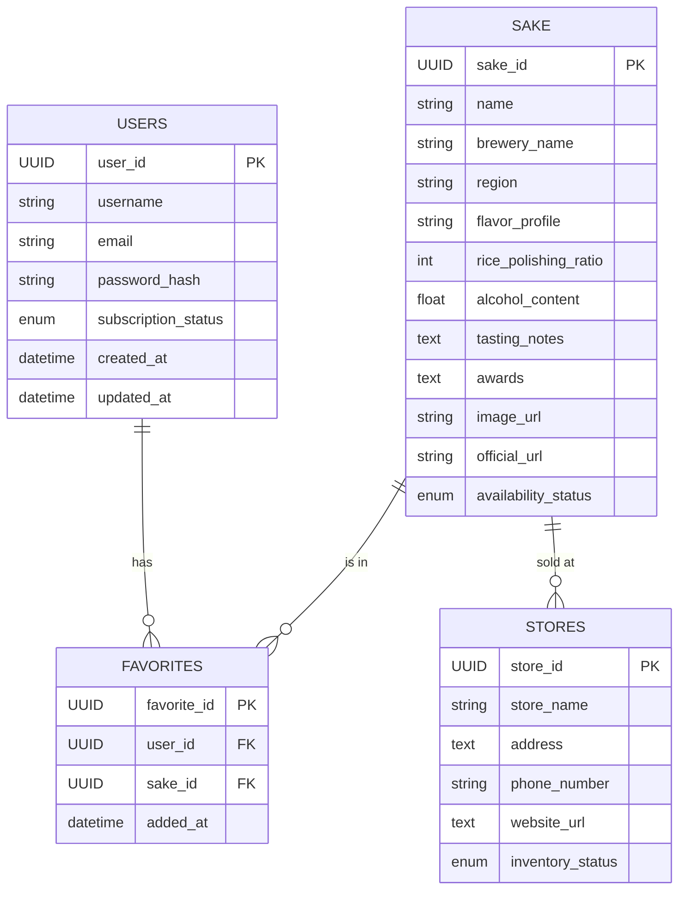

```mermaid

erDiagram
    USERS {
        UUID user_id PK
        string username
        string email
        string password_hash
        enum subscription_status
        datetime created_at
        datetime updated_at
    }

    SAKE {
        UUID sake_id PK
        string name
        string brewery_name
        string region
        string flavor_profile
        int rice_polishing_ratio
        float alcohol_content
        text tasting_notes
        text awards
        string image_url
        string official_url
        enum availability_status
    }

    FAVORITES {
        UUID favorite_id PK
        UUID user_id FK
        UUID sake_id FK
        datetime added_at
    }

    STORES {
        UUID store_id PK
        string store_name
        text address
        string phone_number
        text website_url
        enum inventory_status
    }

    USERS ||--o{ FAVORITES : "has"
    SAKE ||--o{ FAVORITES : "is in"
    SAKE ||--o{ STORES : "sold at"

```