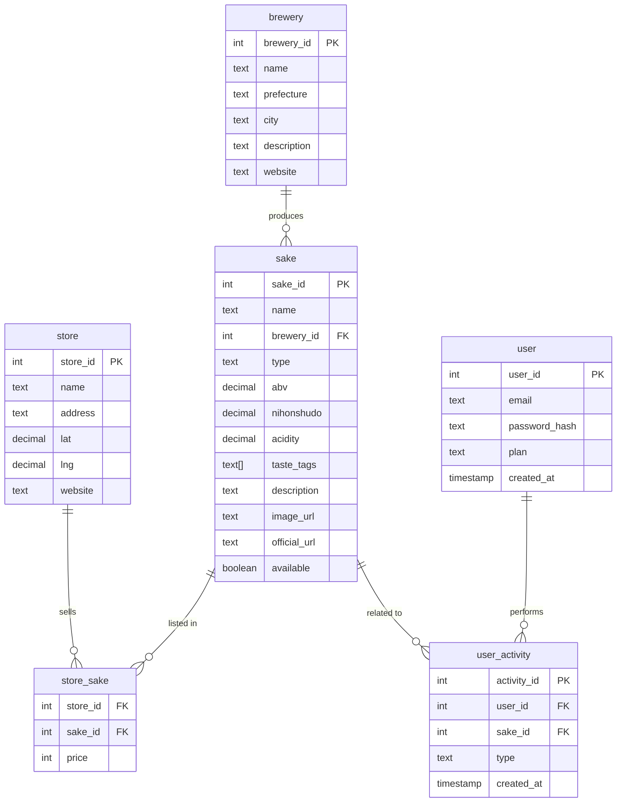

# 日本酒アプリ開発ドキュメント

## 1. アプリ概要
好みの日本酒を探し、販売している酒屋を検索できるアプリ。
- 味や飲み口などの自然言語やざっくりしたイメージからおすすめを提案
- 銘柄検索可能
- 酒蔵の販売サイトに遷移できる機能

## 2. 無料／課金ユーザーの差別化（現時点）
1. **検索回数**
   - 無料：1日5回まで
   - 課金：無制限

2. **LLMによるパーソナル提案**
   - 無料：月10回まで
   - 課金：無制限

3. **表示情報の範囲**
   - 無料：簡易情報（味・酒蔵・写真）
   - 課金：詳細情報（受賞歴、ペアリング提案、販売リンク）

4. **お気に入り登録**
   - 無料：最大5件まで
   - 課金：無制限

## 3. ワイヤーフレーム概要（現行）
- シンプルかつスタイリッシュなUI
- 将来的に酒造や酒屋が情報入力可能な管理画面を追加予定（現時点では実装しない）

## 4. データベース設計（MVP版）
### sake（銘柄）テーブル
- sake_id (PK, int)
- name (text)
- brewery_id (FK)
- type (text)
- abv (decimal)
- nihonshudo (decimal)
- acidity (decimal)
- taste_tags (text[])
- description (text)
- image_url (text)
- official_url (text)
- available (boolean)

### brewery（酒蔵）テーブル
- brewery_id (PK, int)
- name (text)
- prefecture (text)
- city (text)
- description (text)
- website (text)

### store（販売店）テーブル
- store_id (PK, int)
- name (text)
- address (text)
- lat (decimal)
- lng (decimal)
- website (text)

### store_sake（取扱情報）テーブル
- store_id (FK)
- sake_id (FK)
- price (int)

### user（ユーザー）テーブル
- user_id (PK, int)
- email (text)
- password_hash (text)
- plan (text)
- created_at (timestamp)

### user_activity（履歴／お気に入り）テーブル
- activity_id (PK, int)
- user_id (FK)
- sake_id (FK)
- type (text: 'view' / 'favorite')
- created_at (timestamp)

## 5. Mermaid ER図（.mmd / .md用ソース）

## 6. API概要（MVP）
- GET /sake/search?keyword=&taste=&region=&limit=
- GET /sake/{id}
- GET /brewery/{id}
- GET /shops/search?lat=&lng=&radius=
- POST /auth/login
- POST /auth/register
- GET /user/profile
- POST /favorites
- GET /favorites
- POST /sake/recommend (LLMを使ったパーソナル提案)

## 7. API挙動表（無料／課金）

| 機能カテゴリ | エンドポイント例 | 無料ユーザー挙動 | 課金ユーザー挙動 |
|--------------|------------------|------------------|------------------|
| 日本酒検索 | `GET /sake/search` | 1日5回まで。簡易情報のみ（`id`, `name`, `brewery`, `taste_profile`, `image_url`）を返す | 無制限。詳細情報（`awards`, `pairing_suggestions`, `sales_links`）を含めて返す |
| パーソナル提案（LLM使用） | `POST /sake/recommend` | 月10回まで。入力テキストをもとに候補3件を返す | 無制限。候補5件＋詳細説明＋購入リンクを返す |
| お気に入り登録 | `POST /favorites` | 登録は5件まで。超過時はエラー`MAX_LIMIT_REACHED` | 無制限 |
| お気に入り一覧取得 | `GET /favorites` | 最大5件まで表示 | 無制限 |
| 詳細情報取得 | `GET /sake/{id}` | 簡易情報のみ | 受賞歴、ペアリング、販売情報を含めて返す |

## 8. 今後のステップ
1. API仕様書作成（エンドポイントごとのリクエスト／レスポンス詳細）
2. DB詳細設計（インデックス、全文検索方針、データ型最適化）
3. モックAPI実装と結合テスト
4. データ収集フロー設計（公式HP＋品評会情報に限定）
