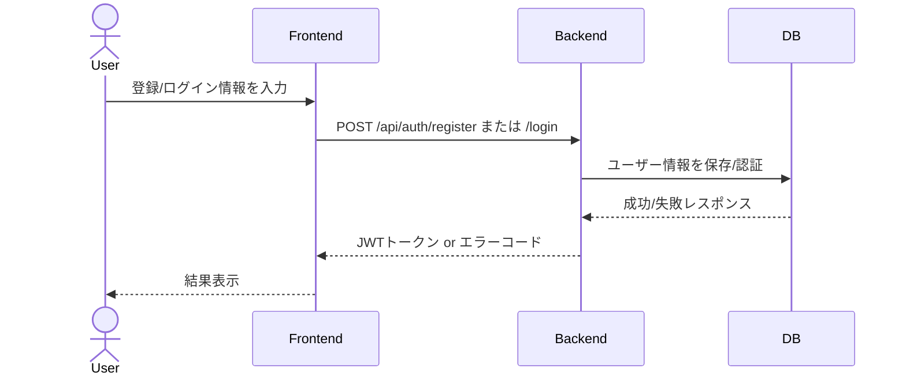
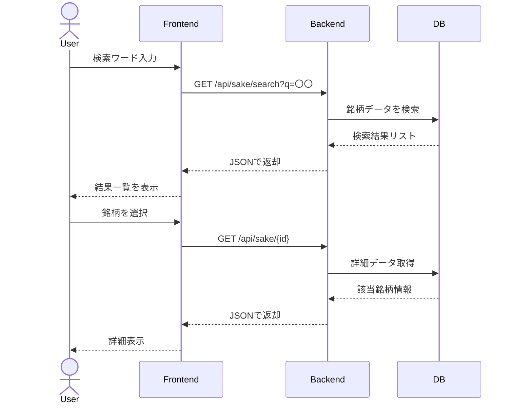
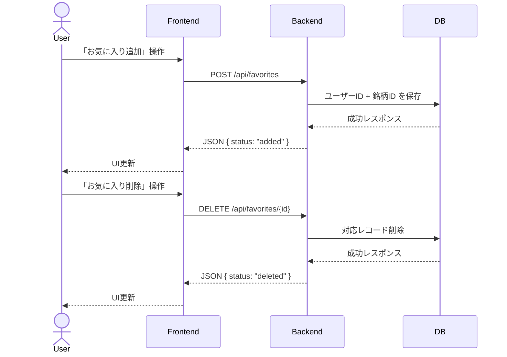
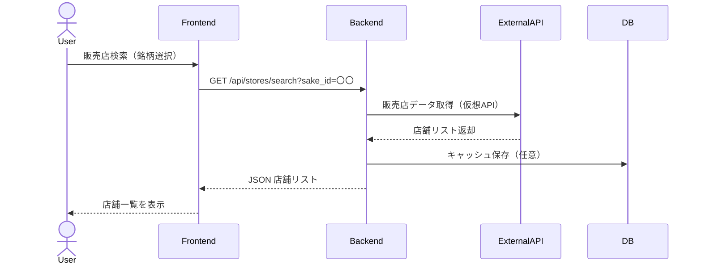

# ユースケース別シーケンス図（概要）

## 1. ユーザー登録 / ログイン

```mermaid
sequenceDiagram
    actor User
    participant Frontend
    participant Backend
    participant DB

    User ->> Frontend: 登録/ログイン情報を入力
    Frontend ->> Backend: POST /api/auth/register または /login
    Backend ->> DB: ユーザー情報を保存/認証
    DB -->> Backend: 成功/失敗レスポンス
    Backend -->> Frontend: JWTトークン or エラーコード
    Frontend -->> User: 結果表示
```

---

## 2. 日本酒検索 → 銘柄詳細表示

```mermaid
sequenceDiagram
    actor User
    participant Frontend
    participant Backend
    participant DB

    User ->> Frontend: 検索ワード入力
    Frontend ->> Backend: GET /api/sake/search?q=〇〇
    Backend ->> DB: 銘柄データを検索
    DB -->> Backend: 検索結果リスト
    Backend -->> Frontend: JSONで返却
    Frontend -->> User: 結果一覧を表示

    User ->> Frontend: 銘柄を選択
    Frontend ->> Backend: GET /api/sake/{id}
    Backend ->> DB: 詳細データ取得
    DB -->> Backend: 該当銘柄情報
    Backend -->> Frontend: JSONで返却
    Frontend -->> User: 詳細表示
```

---

## 3. お気に入り登録 / 削除

```mermaid
sequenceDiagram
    actor User
    participant Frontend
    participant Backend
    participant DB

    User ->> Frontend: 「お気に入り追加」操作
    Frontend ->> Backend: POST /api/favorites
    Backend ->> DB: ユーザーID + 銘柄ID を保存
    DB -->> Backend: 成功レスポンス
    Backend -->> Frontend: JSON { status: "added" }
    Frontend -->> User: UI更新

    User ->> Frontend: 「お気に入り削除」操作
    Frontend ->> Backend: DELETE /api/favorites/{id}
    Backend ->> DB: 対応レコード削除
    DB -->> Backend: 成功レスポンス
    Backend -->> Frontend: JSON { status: "deleted" }
    Frontend -->> User: UI更新
```

---

## 4. （将来機能）販売店検索

```mermaid
sequenceDiagram
    actor User
    participant Frontend
    participant Backend
    participant ExternalAPI
    participant DB

    User ->> Frontend: 販売店検索（銘柄選択）
    Frontend ->> Backend: GET /api/stores/search?sake_id=〇〇
    Backend ->> ExternalAPI: 販売店データ取得（仮想API）
    ExternalAPI -->> Backend: 店舗リスト返却
    Backend ->> DB: キャッシュ保存（任意）
    Backend -->> Frontend: JSON 店舗リスト
    Frontend -->> User: 店舗一覧を表示
```
